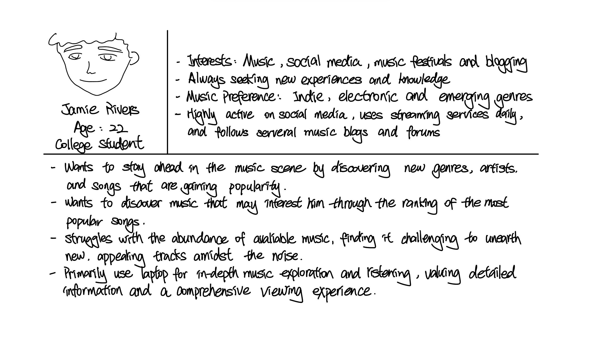

# Project 3, Milestone 1: **Consumer** Design Journey

[← Table of Contents](../design-journey.md)

## _Cohesive_ Audience
> Briefly explain your site's **consumer** audience.
> Your audience should be specific, but not arbitrarily specific.

The site's consumer audience should consist of music lovers who are specifically interested in contemporary music trends and industry updates.

> Be specific and justify why this audience is a **cohesive** group. (1-2 sentences)

This is a cohesive audience because their shared passion for current music trends and industry news binds them together, regardless of their diverse backgrounds. Their common interest in discovering and discussing new music establishes a solid foundation for community engagement and interaction on the website.

## Audience Goals
> Document your **consumer** audience's goals.
> List each goal below. There is no specific number of goals required for this, but you need
> enough to do the job (Hint: It's at least 1, but probably no more than 3).

Goal 1: Discover listening trends of 2023

Goal 2: Music discovery

## Persona
> Use the goals you identified to develop a persona of your site's **consumer** audience.
> Your persona must have a name and a face. The face can be a photo of a face or a drawing, etc.
> You may type out the persona below with bullet points or include an image of the persona.
> Just make sure it's easy to read the persona when previewing markdown.

Persona's Name: Jamie Rivers

## Contributors

I affirm that I am submitting my work for the consumer requirements in this milestone.

Consumer Lead: Xiaoxin Li

[← Table of Contents](../design-journey.md)
