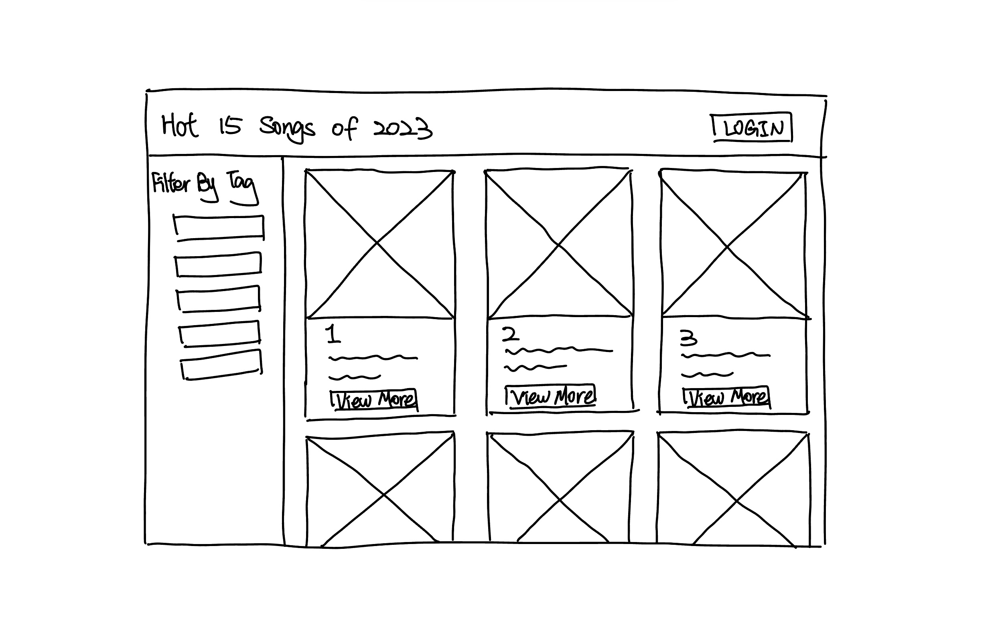

# Project 3, Milestone 2: **Consumer** Design Journey

[← Table of Contents](../design-journey.md)


## Milestone 1 Feedback Revisions
> Explain what you revised in response to the Milestone 1 feedback (1-2 sentences)
> If you didn't make any revisions, explain why.


Based on feedback, reduced the complexity of filtering so that users can only filter by selecting tags without categorizing tags.


## Details Page URL
> Design the URL for the consumer's detail page.
> What is the URL for the detail page?

/details

> What query string parameters will you include in the URL?

| Query String Parameter Name       | Description                         |
| song_id                           | The unique identifier for the song. |


## SQL Query Plan
> Plan the SQL query to retrieve a record from one of your query string parameters.

```
SELECT * FROM songs WHERE id = :song_id;
```

> Plan the SQL query to retrieve all tag names for a specific record.

```
SELECT tags.name FROM tags
JOIN song_tags ON tags.id = song_tags.tag_id
WHERE song_tags.song_id = :song_id;
```


## Contributors

I affirm that I am submitting my work for the consumer requirements in this milestone.

Consumer Lead: Xiaoxin Li


[← Table of Contents](../design-journey.md)
