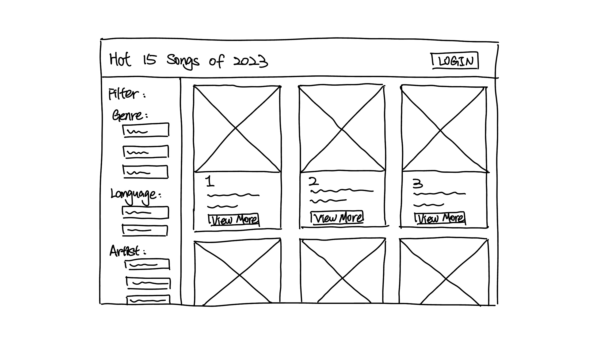
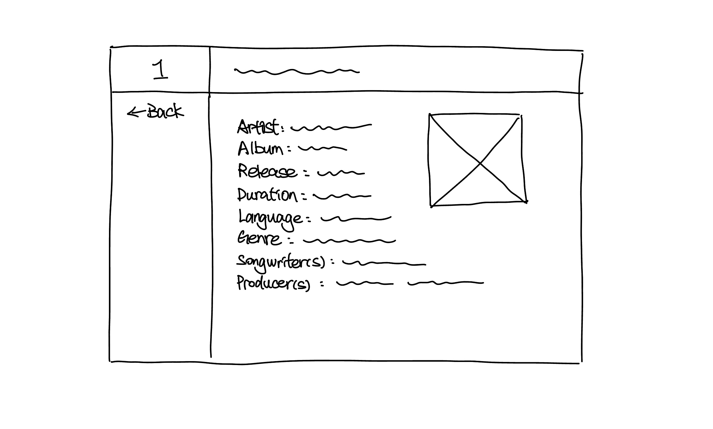
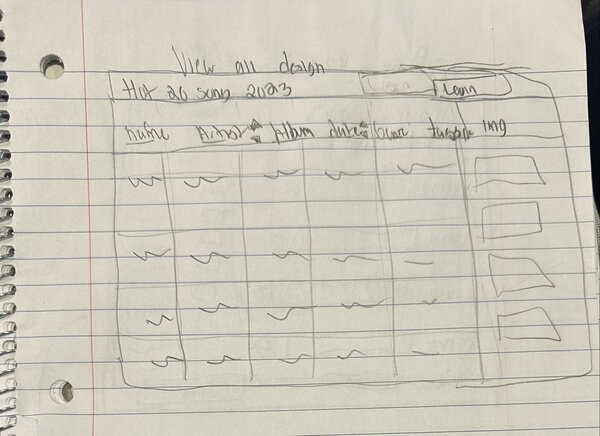
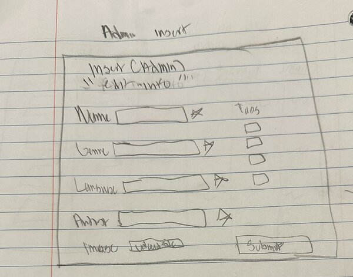
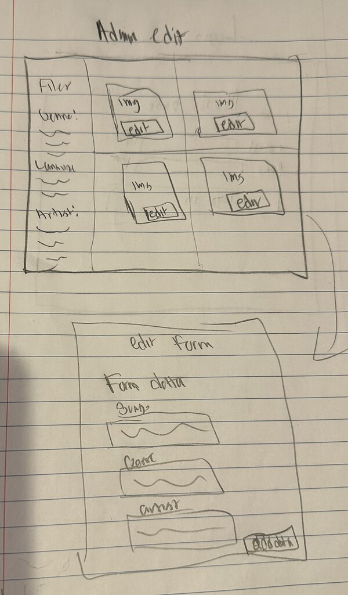
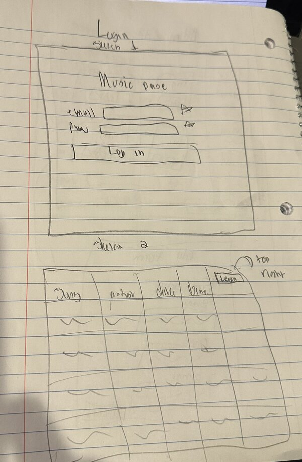

# Project 3, Milestone 1: **Team** Design Journey

[← Table of Contents](design-journey.md)

**Make the case for your decisions using concepts from class, as well as other design principles, theories, examples, and cases from outside of class (includes the design prerequisite for this course).**

You can use bullet points and lists, or full paragraphs, or a combo, whichever is appropriate. The writing should be solid draft quality.

## Catalog
> What will your catalog website be about? (1 sentence)

Hot 20 Songs of 2023

## Narrow or Wide Screen
> How will your **consumer** user access this website? From a narrow or wide screen?

narrow or wide screen

wide screen

## Catalog Design
> Sketch each page of your entire media catalog website
> Provide a brief explanation _underneath_ each sketch. (1 sentence per sketch)
> **Refer to consumer or administrator persona by name in each explanation.**

sketch(es) + explanation

Jamie can utilize the sidebar to filter the displayed list of catalog according to his musical preferences, and he can then explore detailed information about each song by clicking the "View More" buttons.

The detail page provides Jamie with comprehensive song information, including artist, album, and creative credits, alongside an image, facilitating an in-depth understanding of his chosen track.

The admin view page displays the catalgue and all its information, in a table format, with the necessary elements to implement logins, tags/filters in the forseeable future.

the admin insert page is the form that the admin can interact with to input new data.

the admin edit page is for the admin to be able to click on a individual record, and edit its content and submit this edit.

the login page has two iterations, the first is one mirrored in reference to common social medias like instagram for user and admin login, while the second login is moreso just for admin to login and view table data.

## Catalog Design Patterns
> Explain how your design employs common catalog design patterns. (1-2 sentences)

This design employs the common catalog design pattern of a card grid, where each song is presented in its own card with visual and textual information.

The admin pages designs employ common design patterns with a table that sort of mirrors the card/grid but is different displaying all of the data for the website with textual and visual information.

## URL Design
> Plan your HTTP routing.
> List each route and the PHP file for each route.

| Page                                     | Route        | PHP File               |
| ---------------------------------------- | ------------ | --------------------   |
| home / consumer view all / filter by tag | /            | pages/home.php         |
| consumer entry details                   | /details     | pages/details.php      |
| admin view all / filter by tag           | /adminview   | pages/admin-view.php   |
| admin insert entry                       | /admininsert | pages/admin-insert.php |
| admin edit entry / tag / untag           | /adminedit   | pages/admin-edit.php   |
| login                                    | /login       | pages/login.php        |

> Explain why these routes (URLs) are usable for your persona. (1 sentence)

The chosen routing design offers intuitive and straightforward URLs that align with the functionality of each page, making it easy for Jamie to navigate and interact with the site, and for Jay Z to manage content efficiently.

## Database Schema
> Plan the structure of your database. You may use words or a picture.
> A bulleted list is probably the simplest way to do this.
> Include constraints for each field.

**Table:** Hot 20 Songs of 2023

Songs table
- id: INTEGER {PK, AI, NN, U}
- ranking: INTEGER {NN}
- song_name: TEXT {NN}
- artist: TEXT {NN}
- album: TEXT {NN}
- release_date: TEXT
- genre: TEXT
- language: TEXT

Tags Table
  id INTEGER NOT NULL UNIQUE,
  name TEXT NOT NULL UNIQUE,
  PRIMARY KEY(id AUTOINCREMENT)

song_tags Table
  id INTEGER NOT NULL UNIQUE,
  song_id INTEGER NOT NULL,
  tag_id INTEGER NOT NULL,
  FOREIGN KEY(song_id) REFERENCES songs(id),
  FOREIGN KEY(tag_id) REFERENCES tags(id),
  PRIMARY KEY(song_id, tag_id),
  PRIMARY KEY(id AUTOINCREMENT)

Featuring a detailed structure that includes a songs table, a tags table, and a song_tags table to establish relationships between songs and their descriptive tags. Each song is uniquely identified by an autoincremented ID, with additional fields capturing the song's ranking as an integer to represent popularity, the song's name, the artist and album as integers which may serve as foreign keys to respective artist and album tables, the release date of the song stored as text, the song's genre, and the languages of the song, all stored as text fields. The tags table facilitates the categorization of songs, equipped with fields for a unique, autoincremented ID and the tag's name, ensuring each tag is distinct. The song_tags table plays role in forming a many-to-many relationship between songs and tags, with each record uniquely identified and linking back to the songs and tags tables through their IDs.

## Contributors

I affirm that I have contributed to the team requirements for this milestone.

Consumer Lead: Xiaoxin Li

Admin Lead: Troy Corbitt

[← Table of Contents](design-journey.md)
